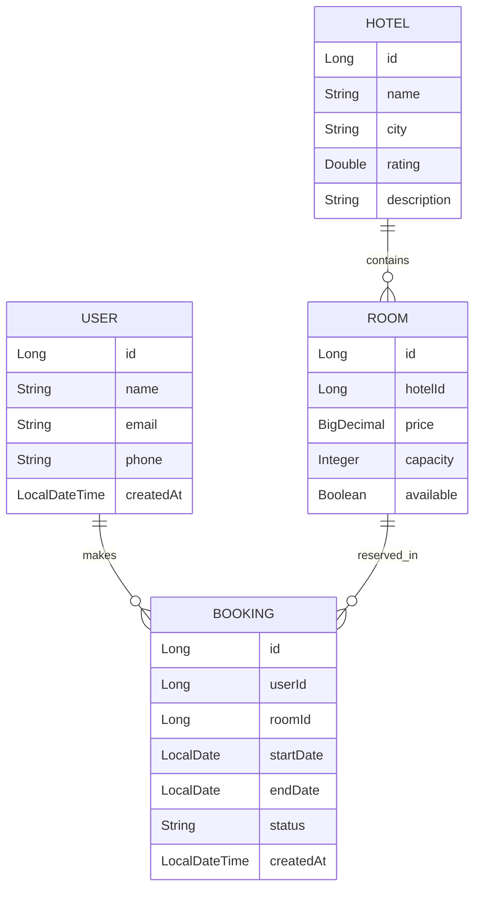

# Hotel Management System Implementation Plan

This plan outlines the steps to build a production-ready Hotel Management System with a Java Spring Boot backend and a React TypeScript frontend.

## User Review Required

> [!IMPORTANT]
> - **Technology Stack**: Backend uses Java 17+ (Spring Boot 3.x), PostgreSQL, and Kafka. Frontend uses React 19, TypeScript, and Tailwind CSS.
> - **Kafka Setup**: Expect a local Kafka instance for event orchestration.
> - **Concurrency**: Handled using JPA pessimistic/optimistic locking to prevent double booking.

## Proposed Changes

### Backend (Java Spring Boot)

#### [NEW] [pom.xml](file:///d:/Hotel-Management/backend/pom.xml)
- Spring Data JPA, Web, PostgreSQL, Validation, MapStruct, Lombok, Kafka, GraphQL.

#### [NEW] [Project Structure](file:///d:/Hotel-Management/backend/src/main/java/com/hotelmanagement)
- **Entities**: `User`, `Hotel`, `Room`, `Booking`.
- **Controllers**: `UserController`, `HotelController`, `RoomController`, `BookingController`.
- **Services**: Business logic with availability checks and booking management.
- **Repositories**: Standard JPA repositories with custom query methods for search/filters.
- **DTOs & Mappers**: Using MapStruct for clean conversion.
- **Messaging**: `BookingEventProducer` and `BookingEventConsumer`.
- **ExceptionHandler**: Global handling for common errors (Conflict, NotFound, etc.).

### Frontend (React + TypeScript)

#### [NEW] [frontend/package.json](file:///d:/Hotel-Management/frontend/package.json)
- React, Vite, Axios, Lucide Icons, Date-fns.

#### [NEW] [frontend/src](file:///d:/Hotel-Management/frontend/src)
- **Components**: `Navbar`, `HotelCard`, `RoomCard`, `BookingForm`, `SearchBar`, `Pagination`, `FilterPanel`.
- **Pages**: `Dashboard`, `HotelList`, `HotelDetails`, `RoomList`, `BookingPage`, `UserBookings`, `AdminHotelManagement`.
- **API Service**: Axios instance with baseURL and reusable methods.

### Infrastructure

#### [NEW] [docker-compose.yml](file:///d:/Hotel-Management/docker-compose.yml)
- PostgreSQL
- Kafka & Zookeeper (or KRaft)
- Backend Service
- Frontend Service

## Database Schema

## API Endpoints List

### Users
- `POST /api/users` - Create User
- `GET /api/users/{id}/bookings` - Get user bookings

### Hotels
- `POST /api/hotels` - Add Hotel (Admin)
- `GET /api/hotels` - Search/Filter hotels (city, rating, pagination)
- `GET /api/hotels/{id}` - Get hotel details

### Rooms
- `POST /api/hotels/{hotelId}/rooms` - Add Room (Admin)
- `GET /api/hotels/{hotelId}/rooms` - Get rooms with availability check

### Bookings
- `POST /api/bookings` - Create Booking (Prevent double booking)
- `PUT /api/bookings/{id}/cancel` - Cancel Booking

## Open Questions

- Should I use Spring Security for authentication, or just implement basic User Management as requested?
- Do you want Sample Data (Seeding) included in the initial build?

## Verification Plan

### Automated Tests
- JUnit tests for Booking Service (Concurrency and Double Booking).
- Integration tests for API endpoints.
- Frontend component tests with Vitest (optional).

### Manual Verification
1. Run `docker-compose up`.
2. Access Frontend at `http://localhost:5173`.
3. Create a User.
4. Add a Hotel and Rooms.
5. Perform a search.
6. Book a room and verify Kafka event logs.
7. Attempt to book the same room on the same dates to verify "Prevent Double Booking".
